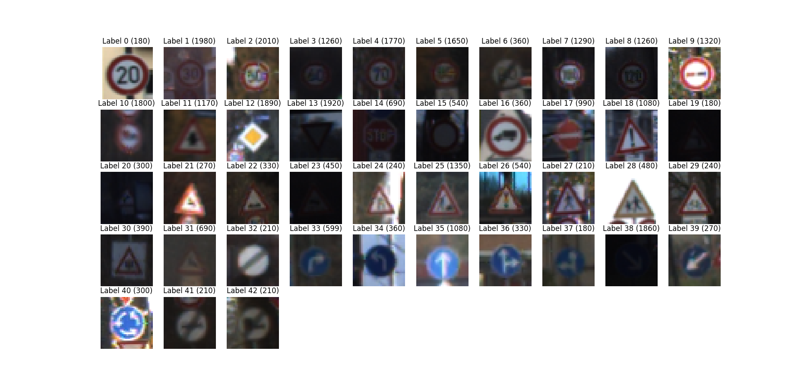

#**Traffic Sign Classifier**

Pantelis Monogioudis

NOKIA

## Summary
For German traffic signs classification, the Keras API was used to define a deep neural network and train its hyperparameters. For optimizing the hyperparameters of the model, the scikit-learn python library search API was used as described in the model training section. We have investigated various architectures starting from the LeNet network and adding overfitting mitigation and complexity reduction layers. The performance of the test dataset as well as the performance of random 5 images collected from the internet shows that the selected architecture as well as the hyperparameter search (although not exhaustive) performs well and can be easily replicated by cloning two separate repos: the [project code](https://github.com/pantelis/traffic-sign-classifier) and the [project data](https://github.com/pantelis/traffic-signs-data).  The goals / steps of this project are the following:
* Load, Explore, summarize and visualize the data set
* Design, train and test a model architecture
* Use the model to make predictions on new images
* Analyze the softmax probabilities of the new images

[//]: # (Image References)

[dataset-summary]: ./traffic-signs-dataset-statistics.png "Dataset Summary"
[dataset-visual-histogram]: ./traffic-signs-visual-histogram.png "Visual Histogram"
{:height="200px" width="300px"}
[image2]: ./examples/grayscale.jpg "Grayscaling"
[image3]: ./examples/random_noise.jpg "Random Noise"
[dataset-summary]: ./traffic-signs-dataset-statistics.png "Dataset Summary"
[dataset-visual-histogram]: ./traffic-signs-visual-histogram.png "Visual Histogram"
[nested-cv]: (https://github.com/pantelis/traffic-sign-classifier/blob/master/nested-cv.jpg) "Nested CV"
[simple-cv]: (https://github.com/pantelis/traffic-sign-classifier/blob/master/simple-cv.jpg) "Simple CV"
[sign1]: ../traffic-signs-data/sign1.jpg "Traffic Sign 1"
[sign2]: ../traffic-signs-data/sign2.jpg "Traffic Sign 2"
[sign3]: ../traffic-signs-data/sign3.jpg "Traffic Sign 3"
[sign4]: ../traffic-signs-data/sign4.jpg "Traffic Sign 4"
[sign5]: ../traffic-signs-data/sign5.jpg "Traffic Sign 5"

### Data Set Summary & Exploration
A summary of the traffic signs data set is shown in

![][dataset-summary]
_Dataset summary_

A visual inspection of the unique signs of the dataset is shown in

![dataset-visual-histogram].


<!--  -->
_Visual histogram of unique signs in the dataset_


### Design and Test a Model Architecture

#### Normalization
The only pre-processing step applied was that of normalization. We normalized the dataset images by dividing each pixel by 255 and subtracting 0.5 from the result.

#### Model Architecture
The final model architecture is shown in the following table. The model was implemented in Keras with a TensorFlow (TF) backend.

| Layer         		|     Description in Keras API	        					|
|:---------------------:|:---------------------------------------------:| 
| Input         		| 32x32x3 RGB image   							| 
| Convolution 3x3     	| model.add(Convolution2D(32, 3, 3, input_shape=(32, 32, 3)))    |
| Max Pooling					| model.add(MaxPooling2D((2, 2)))												|
| Dropout					|	model.add(Dropout(0.5))											|
| RELU					|	model.add(Activation('relu'))											|
| Flatten	      	| model.add(Flatten())				|
| Fully Connected    |     		model.add(Dense(128))							|
| RELU					|	model.add(Activation('relu'))											|
| Fully connected		| model.add(Dense(43))	        									|
| Softmax				| model.add(Activation('softmax'))        									|

#### Model Training
The approach adopted involved various steps that involved optimizing the parameters of the model (hyperparameters) given the architecture outlined in the previous section.

To help the search process we used sklearn's ```GridSearchCV``` feature. When constructing this class you must provide a dictionary of hyperparameters to evaluate in the ```param_grid``` argument. This is a map of the model parameter name and an array of values to try. By default, accuracy is the score that is optimized, but other scores can be specified in the score argument of the GridSearchCV constructor.

The GridSearchCV process when then construct and evaluate one model for each combination of parameters. Cross validation is used to evaluate each individual model and the default of 3-fold cross validation is used, although this can be overridden by specifying the cv argument to the GridSearchCV constructor.

In all experiments to maximize as much as possible repeatability of the results we fixed the random seed of numpy.

---

In this case, discuss why you think the architecture is suitable for the current problem.

My final model results were:
* training set accuracy of ?
* validation set accuracy of ?
* test set accuracy of ?

If an iterative approach was chosen:
* What was the first architecture that was tried and why was it chosen?
* What were some problems with the initial architecture?
* How was the architecture adjusted and why was it adjusted? Typical adjustments could include choosing a different model architecture, adding or taking away layers (pooling, dropout, convolution, etc), using an activation function or changing the activation function. One common justification for adjusting an architecture would be due to overfitting or underfitting. A high accuracy on the training set but low accuracy on the validation set indicates over fitting; a low accuracy on both sets indicates under fitting.
* Which parameters were tuned? How were they adjusted and why?
* What are some of the important design choices and why were they chosen? For example, why might a convolution layer work well with this problem? How might a dropout layer help with creating a successful model?


If a well known architecture was chosen:
* What architecture was chosen?
* Why did you believe it would be relevant to the traffic sign application?
* How does the final model's accuracy on the training, validation and test set provide evidence that the model is working well?

#### Cross-validation Strategy
We should point out that there are two options for CV in problems where both architecture and hyperparameters need to determined. The first option involves at least one *nested* cross-validation loop as shown in ![][nested-cv].


#### Optimization of batch size and Number of Epochs


###Test a Model on New Images

####1. Choose five German traffic signs found on the web and provide them in the report. For each image, discuss what quality or qualities might be difficult to classify.

Here are five German traffic signs that I found on the web:

![alt text][image4] ![alt text][image5] ![alt text][image6] 
![alt text][image7] ![alt text][image8]

The first image might be difficult to classify because ...

####2. Discuss the model's predictions on these new traffic signs and compare the results to predicting on the test set. At a minimum, discuss what the predictions were, the accuracy on these new predictions, and compare the accuracy to the accuracy on the test set (OPTIONAL: Discuss the results in more detail as described in the "Stand Out Suggestions" part of the rubric).

Here are the results of the prediction:

| Image			        |     Prediction	        					| 
|:---------------------:|:---------------------------------------------:| 
| Stop Sign      		| Stop sign   									| 
| U-turn     			| U-turn 										|
| Yield					| Yield											|
| 100 km/h	      		| Bumpy Road					 				|
| Slippery Road			| Slippery Road      							|


The model was able to correctly guess 4 of the 5 traffic signs, which gives an accuracy of 80%. This compares favorably to the accuracy on the test set of ...

####3. Describe how certain the model is when predicting on each of the five new images by looking at the softmax probabilities for each prediction. Provide the top 5 softmax probabilities for each image along with the sign type of each probability. (OPTIONAL: as described in the "Stand Out Suggestions" part of the rubric, visualizations can also be provided such as bar charts)

The code for making predictions on my final model is located in the 11th cell of the Ipython notebook.

For the first image, the model is relatively sure that this is a stop sign (probability of 0.6), and the image does contain a stop sign. The top five soft max probabilities were

| Probability         	|     Prediction	        					| 
|:---------------------:|:---------------------------------------------:| 
| .60         			| Stop sign   									| 
| .20     				| U-turn 										|
| .05					| Yield											|
| .04	      			| Bumpy Road					 				|
| .01				    | Slippery Road      							|


For the second image ... 

### (Optional) Visualizing the Neural Network (See Step 4 of the Ipython notebook for more details)
####1. Discuss the visual output of your trained network's feature maps. What characteristics did the neural network use to make classifications?


